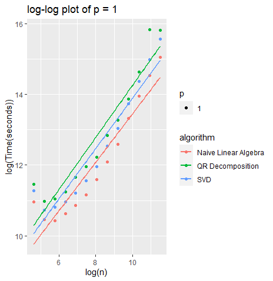
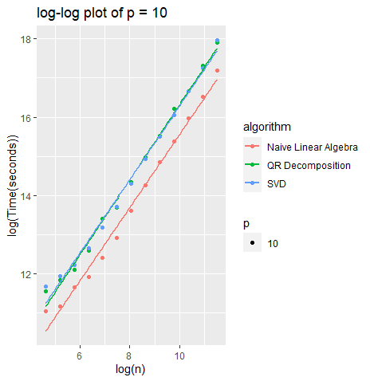
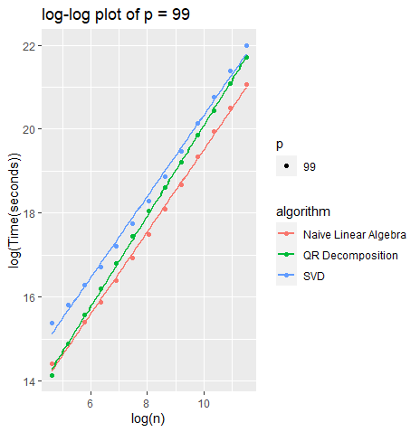

## Question 1

**(a) Derive/show how to compute linear regression coefficients (for general choice of y and X) using the following four methods: naive linear algebra; QR decomposition; SVD; and Cholesky decomposition.**

**Naive Linear Algebra**

Let $X$ be the design matrix with $n$ observations and $p$ features with a response variable $y$.

The linear regression model is given by $xhatY = X\hat\beta + \epsilon$.

Recall that ordinary least squares obtains its regression coefficients by minimizing the residual sum of squares (RSS). With this in mind:

$$\epsilon = Y - X\hat\beta$$

$$RSS = \epsilon'\epsilon= (Y - X\hat\beta)'(Y- X\hat\beta)$$

Since we are trying to obtain the regression coefficients that minimize the residual sum of squares, me take the derivative of the RSS with respect to $\beta$ and set it equal to zero.

$$\frac{\partial RSS}{\partial \hat\beta} = \frac{\partial}{\partial \hat\beta} (Y - X\hat\beta)'(Y- X\hat\beta) = \frac{\partial}{\partial \hat\beta} Y'Y - Y'X\hat\beta - Y\hat\beta'X' + \hat\beta'X'X\hat\beta = \frac{\partial}{\partial \hat\beta} Y'Y - 2\hat\beta X'y + \hat\beta'X'X\hat\beta$$

$$ = \frac{\partial}{\partial \hat\beta} Y'Y - 2\hat\beta X'y + \hat\beta'X'X\hat\beta = -2X'y + 2X'X\hat\beta = 0 $$


$$ 2X'y = 2X'X\hat\beta $$
$$ X'y = X'X\hat\beta $$
$$\hat\beta = (X'X)^{-1}(X'y) $$
Thus, the linear regression coefficient for naive linear algebra is $\hat\beta = (X'X)^{-1}(X'y)$.

**QR Decomposition**

Recall that QR is a factorization of the design matrix, $X$, into two matrices: $Q$ a orthogonal matrix and $R$ an upper-triangular matrix.

Let $X$ be the design matrix with $n$ observations and $p$ features with a response variable $y$. Let $b$ be the transformed response vector.

The linear regression model is given by $xhatY = X\hat\beta + \epsilon$.


If we pick up at $\hat\beta = (X'X)^{-1}(X'y)$, we can actually substitute in $QR$ in the place of $X$.

$$ \hat\beta = (X'X)^{-1}(X'y) = ((QR)'(QR))^{-1}(QR)'y = (R'Q'QR)^{-1}Q'y = (R'R)^{-1}Q'y$$
$$R'R\hat\beta = Q'y $$
$$(R')^{-1}R'R\hat\beta = (R')^{-1}R'Q'y $$
$$R\hat\beta = Q'y $$

Or equivalent,

$$\hat\beta = R^{-1}Q'y$$

Thus, the linear regression coefficients can be obtained by QR decomposition by solving $R\hat\beta = Q'y$.

**SVD**

Recall that when using Singular value decomposition (SVD), we are given a unitary matrix, $U$, a diagonal matrix, $D$, which contains singular values and the conjugate transpose of $U$ which we will denote as $V'$.

Let $X$ be the design matrix with $n$ observations and $p$ features with a response variable $y$. Let $b$ be the transformed response vector.

Let us take $X = UDV'$ and plug this into the OLS in the naive approach:

$$\hat\beta = (X'X)^{-1}(X'y) = ((UDV')'(UDV'))^{-1}(UDV')'y $$ 
$$ = (VD'U'UDV')^{-1}(VD'U')y $$

Note, D = D' as it is a diagonal matrix.

$$ = (VD(U'U)DV')^{-1}(VDU')y $$

Now, we also recognize that $(U'U) = I$ 

$$ = (VDIDV')^{-1}(VDU')y $$

$$ = (VD^2V')^{-1}(VDU')y $$
$$ = (V')^{-1}(D^2)^{-1}V^{-1}(VDU')y $$
But notice that the inverse of $V$ is $V'$ as well as the inverse of $D^2$ is equal to a diagonal matrix with inverse of the of the diagonal entries (which are singular). Assuming that $\sigma > 0$  to ensure the inverse exists:

$$ (V')^{-1}(D^2)^{-1}V^{-1} = VD^{-2}V'$$
Thus, 

$$ \hat\beta =  VD^{-2}V'VDU'y = VD^{-2}DU'y = VD^{-1}Uy$$
So, the linear regression coefficients using SVD can be found by $\hat\beta = VD^{-1}Uy$$.

**Cholesky Decomposition**

Recall that the cholesky decomposition is expressed as $A = LL^*$ where $L$ is the lower triangular matrix that is invertible and $L^*$ is its conjugate transpose. In theory $L*$ will be an upper triangle matrix.

Let $X$ be the design matrix with $n$ observations and $p$ features with a response variable $y$. Let $b$ be the transformed response vector.

Let us begin with $A'Ax = A'b$ where $A$ is some matrix.

We know then by the cholesky decomposition theorem that we can then rewrite that equation as $A'A = LL'$ since $A'A$ is positive definite.

Thus, the equations reduce to 

$$ LL'x = A'b $$

where the system can simply be solved by first obtaining the solution to the equation $Lz = A'b$ using forward substitution and then using backwards substitution to solve for $L'x = z$. 

**(b) Pick three of the four algorithms and implement them in the language of your choice. Benchmark your algorithms for a range of magnitudes of $p$ and $n$ covering at least one order of magnitude in $p$ and at least two orders of magnitude in $n$.  Plot your results on a log-log scale. Fit a log-log model to the average times (you can leave out some points if they mess up the scaling relationship).**


```{r, warnings = FALSE, message=FALSE, eval = FALSE}
library(microbenchmark)
library(ggplot2)

ps <- c(1,10,99)
ns <- round(10^seq(2,5,by = 0.25))

results <- matrix(NA, ncol = 4, nrow = 39*3)
colnames(results) <- c("p", "n", "time", "algorithm")
index <- 1


set.seed(123)
simfun <- function (n,p) {
  y <- matrix(rnorm(n), ncol = 1)
  X <- matrix(rnorm(p*n), nrow = n, ncol = p)
  list(X = X, y = y)
  
}

#function to perform the OLS regression

ols_reg <- function(X, y) {
  X_ <- cbind(1, X) # adding intercept here
  return(solve(t(X_)%*%X_)%*%t(X_)%*%y)
}

qr_reg <- function(X, y) {
  X_ <- cbind(1, X) #add intercept here
  QR <- qr(X_)
  R <- qr.R(QR)  #extract R matrix
  Q <- qr.Q(QR) #extract Q matrix
  
  B <- t(Q)%*%y #Compute B
  
  beta_reg <- backsolve(R,B) #backsolve to find beta
  
  return(beta_reg)
}

SVD_reg <- function(X, y) {
  X_ <- cbind(1,X) # add an intercept
  S <- svd(X_)
  return(S$v%*%diag(1/S$d)%*%t(S$u)%*%y)  
}

#parameters for benchmarking

for (n in ns) {
  for (p in ps) {
    s<-simfun(n,p)
    benchmark_trial <- microbenchmark(ols_reg(s$X,s$y))
    results[index,] <- c(p,n, mean(benchmark_trial$time), "Naive Linear Algebra")
    index <- index + 1
  }
}

for (n in ns) {
  for (p in ps) {
    s<-simfun(n,p)
    benchmark_trial <- microbenchmark(qr_reg(s$X,s$y))
    results[index,] <- c(p,n, mean(benchmark_trial$time), "QR Decomposition")
    index <- index + 1
  }
}

for (n in ns) {
  for (p in ps) {
    s<-simfun(n,p)
    benchmark_trial <- microbenchmark(SVD_reg(s$X,s$y))
    results[index,] <- c(p,n, mean(benchmark_trial$time), "SVD")
    index <- index + 1
  }
}

results_final<- as.data.frame(results)

#take log of columns

results_final$logn<- log(as.numeric(results_final$n))
results_final$logtime<- log(as.numeric(results_final$time))


# p = 1
plot1 <- ggplot(data = results_final[results_final$p == 1, ], 
                aes(x = logn, y = logtime, color = algorithm, shape = p)) +
  ggtitle("log-log plot of p = 1") +
  geom_point() +
  geom_smooth(method = "lm", se = FALSE) +
  labs(x = "log(n)", y = "log(Time(seconds))", color = "algorithm", shape = "p")
# p = 10
plot2 <- ggplot(data = results_final[results_final$p == 10, ], 
                aes(x = logn, y = logtime, color = algorithm, shape = p)) +
  ggtitle("log-log plot of p = 10") +
  geom_point() +
  geom_smooth(method = "lm", se = FALSE) +
  labs(x = "log(n)", y = "log(Time(seconds))", color = "algorithm", shape = "p")

# p = 99
plot3 <- ggplot(data = results_final[results_final$p == 99, ], 
                aes(x = logn, y = logtime, color = algorithm, shape = p)) +
  ggtitle("log-log plot of p = 99") +
  geom_point() +
  geom_smooth(method = "lm", se = FALSE) +
  labs(x = "log(n)", y = "log(Time(seconds))", color = "algorithm", shape = "p")


```


```{r, warnings = FALSE, message=FALSE, echo=FALSE, out.width = '50%', out.height='50%'}

#here i will import the plots just because that chunk takes 20 minutes to run





```

The above plot shows three of the algorithms discussed over a range of $n$ observations and $p$ predictors accordingly. Moreover, we used the lm.fit to fit the log-log model as instructed in the question. Unstable values of $n$ and $p$ were left out to avoid issues moving forwards. Some observations are that as the $n$ increases, the time it takes to run also increases and thus the computational expense will as well across the three algorithms. In the next question (i.e. 1(c)), we will compare our results to computational complexity already published.


**(c) Optionally, look up the computational (time) complexity of each of the original four methods as a function of $p$ (number of predictors/columns of X) and $n$ (number of observations/length of y/rows of X); do they agree with your computational results?**

For the purpose of this question, we will be referencing sources : https://math.uchicago.edu/~may/REU2012/REUPapers/Lee.pdf and https://stackoverflow.com/questions/1955088/what-is-the-bigo-of-linear-regression.

This paper discusses the derivation of the QR factorization computational cost to be approximately $2mn^2$ flops. For SVD, it suggests that the cost for that algorithm is $2mn^2 + 11n^2$ and finally the Naive linear algebra cost was found to also be $O(k^2(n+k))$. Note, $m$ in the two costs for SVD and QR are equivalent to the $k$ variable that we are analyzing. When comparing these computational costs to our plot results in part (b) we see that our results are in agreement in terms of general trends (i.e. the algorithms performance against one another). In order to see if it is in full agreement, we would likely have to find the exact fit (rather than fit an lm.fit onto the log-log scale) to see if it aligns perfectly with the computational complexity of each algorithm.

\newpage

## Question 2

For this question, we must use QR Factorization with ridge regression and compare it to the native implementation of ridge regression (using glmnet).

```{r}
# read the data in
df <- read.table("https://hastie.su.domains/ElemStatLearn/datasets/prostate.data")

#break up the train/test

train <- df[df$train == "TRUE",]
test <- df[df$train == "FALSE",]

#split up the train/test for x and y with a seed


x = as.matrix(df[,1:8])
y = as.matrix(df[,9])


#doing a 75/25 split
set.seed(123)
indices <- sample(1:nrow(x), size = 0.75*nrow(x), replace = FALSE)


train_x = x[indices, ]
train_y = y[indices, ]
test_x = x[-indices, ]
test_y = y[-indices, ]
```

**Native Implementation of Ridge Regression**

In this implementation, we will use 'glmnet' to get our model fit.

```{r, warnings = FALSE, messages = FALSE}
library(glmnet)

#fit the ridge regression model- first we must find the optimal lambda
fit = cv.glmnet(train_x, train_y, alpha = 0)

#plot(fit)

optimal_lambda = fit$lambda.min
start.time <- Sys.time()
final_fit = glmnet(train_x, train_y, alpha = 0, lambda = optimal_lambda)
end.time<- Sys.time()

test_pred_rr = predict(final_fit, s = optimal_lambda, newx = test_x)
mean_squared_error = mean((test_y - test_pred_rr)^2)
Rsq <- 1 - sum((test_y - test_pred_rr)^2)/sum((test_y - mean(test_y))^2)
time.taken1 <- end.time - start.time

```

**QR Factorization and then Ridge regression (i.e. Ridge Regression by Data Augmentation)**


```{r}
#First, we must perform the QR factorization of train_x

QR <- qr(train_x)

Q <- qr.Q(QR)

#form the response variable b appropriately

b <- t(Q)%*%train_y

#add in the regularization term (i.e. lambda) to the diagonal elements of the 
#R matrix - for simplicity I will use the optimal lambda

R <- qr.R(QR)

n <- ncol(R)

R[1:n, 1:n] <- R[1:n, 1:n] + optimal_lambda*diag(n)

#Solve the regularized triangular linear system for the regularized coefficient
# vector beta_reg
start.time <- Sys.time()
Beta_reg <- backsolve(R, b)
end.time <- Sys.time()


time.taken2 <- end.time - start.time
#Test it out

y_pred <- test_x%*%Beta_reg
Rsq_qr <- 1 - sum((test_y - y_pred)^2)/sum((test_y - mean(test_y))^2)


```

**Comparison of the Two Techniques**

Observing the two methods, both have its advantages. Note, I used the same lambda for both methods in order to obtain results that I could compare. One metric I used was the $R^2$ value that can tell us the proportion of variation in the dependent variable that can be attributed to the independent variable. For the native implementation, we observe a value of 0.6614124 which means that 66.1% of the variation is explained by the model using this approach. The time taken for the system to compute this approach was 0.01833105 seconds. Conversely, for the ridge regression by data augmentation (using QR factorization), we observe an $R^2$ value of 0.7054944 which suggests that roughly 71% of the variation is explained by the model which is an improvement. The time taken for this algorithm was 0.007303953 seconds. Note, that although I did the raw steps of the factorization for ridge regression, you could also simply do qr.solve to attain the same result (potentially faster time as well). This means that ridge regression by data augmentation (using QR factorization) outperforms the native implementation of ridge regression (i.e. the 'glmnet' function).

\newpage

## Question 3

**Exercise 3.6**

From the question we are given that $y \sim N(X\beta, \sigma^2 I)$ and the prior $\beta \sim N(0, \tau I)$.

For this problem, we will use Bayes' rule to help determine the relationship between the variances $\tau$, $\sigma^2$ and the regularization parameter $\lambda$.

Using Bayes' rule we get,

$p(\beta| D) = p(D | \beta)p(\beta) = N(y - X\beta, \sigma^2 I)N(0, \tau I)$

Note, I used $\tau$ as the variance here as some literature with respect to normal distributions square the variance.

Now, we can write the normal density function of $x$ as follows,

$$f_X(x) = \frac{1}{(2\pi)^{p/2}|\Sigma|^{1/2}}e^{-\frac{1}{2}(X-\mu)'(\Sigma)^{-1}(x-\mu)} = N_p(\mu, \Sigma) ...(1)$$
where $\mu$ is the mean vector and $\Sigma$ is the covariance matrix

**Find the relationship between the between the regularization parameter $\lambda$ and the variances $\sigma^2$, $\tau$**

If we take the log on both sides of the Bayes' rule formula above, we obtain,

$$log(p(\beta |D)) = log(p(D| \beta)p(\beta)) $$
$$ = log(p(D| \beta)) + log(p(\beta))$$

$$ = log(N(y - X\beta, \sigma^2 I) + log(N(0, \tau I))$$

Now, sub in the appropriate fomrulas into the normal density function above for the respective normal distributions.

$$ = log(\frac{1}{(2\pi)^{p/2}\sigma}e^{-\frac{1}{2}(y - X\beta)'(\sigma)^{-1}(y - X\beta))} + log(\frac{1}{(2\pi)^{p/2}\tau^{1/2}}-e^{\frac{1}{2}\beta'(\tau)^{-1}\beta)} ... (2)$$
Simplifying this algebraic expression further, we arrive at the simplified term of,

$$= log(\frac{1}{(2\pi)^{p/2}\sigma} + \frac{1}{(2\pi)^{p/2}\tau^{1/2}})- \frac{1}{2}\frac{(y - X\beta)'(y - X\beta)}{\sigma^2}- \frac{1}{2}\frac{(\beta)'\beta)}{\tau} $$
We now arrive at a minimization problem and using techniques outlined by ESL, we can rewrite the equation as,

$$ \hat\beta = argmin_{\beta}(\frac{(y - X\beta)'(y - X\beta)}{\sigma^2} + \frac{(\beta)'\beta)}{\tau})$$

Note, I massaged the equation by multiplying the non constant coefficients by $-2$ to get an appropriate result.

$$ \hat\beta = argmin_{\beta}({(y - X\beta)'(y - X\beta)} + \frac{\sigma^2(\beta)'\beta)}{\tau})$$
Observe, this value is equivalent to equation (3.43) in the ESL book, where $\lambda = \frac{\sigma^2}{\tau}$. Thus, we conclude that the relationship between the between the regularization parameter $\lambda$ and the variances $\sigma^2$, $\tau$ is simply $\lambda = \frac{\sigma^2}{\tau}$.


**Show that the ridge regression estimate is the mean (or mode)**

We will show that the mean, call it $\mu$, is equal to $\hat\beta^{ridge}$.

If we observe the density function (1) above and consider both the prior distribution and the normal distribution (2), we see that $|\Sigma|^{-1}$ satisfies the following expression obtained from the textbook

$$\Sigma^{-1} = \frac{1}{\sigma^2}(X'X + \frac{\sigma^2}{\tau}I) $$.

If we substitute this value into the the equation (3.44) of ESL, we clearly see that $\hat\beta = \frac{1}{\sigma^2}\Sigma X'y$. 

Equating both sides of the equation, we observe that this will be the mean. Thus, the ridge regression estimate is simply the mean (or mode) of the prior distribution.

\newpage

**Exercise 3.19**

**Show it increases for Ridge Regression**

From the text book, consider the definition for the $\hat\beta_{ridge}$.


$$\hat\beta_{ridge} = (X'X + \lambda I)^{-1} X'y$$
$$ = (VD^2V' + \lambda VV')^{-1} VDU'y $$
$$ = (V(D^2 + \lambda I)V')^{-1} VDU'y $$
$$ = (V')^{-1}(D^2 +\lambda I)^{-1}V^{-1}VDU'y$$
$$ = (V')^{-1}(D^2 + \lambda I)^{-1}DU'y$$
But note, by definition of the matrix $V$ in the book, $V^{-1} = V$ and thus we can then write,

$$ = V(D^2 + \lambda I)^{-1}DU'y$$

Now, if we were to take the L2 norm of this expression, we get,

RHS = $(V(D^2 + \lambda I)^{-1}DU'y)'(V(D^2 + \lambda I)^{-1}DU'y)$

Expanding this some more,
$$ = (y'UD'(D^2 + \lambda I)^{-1}V')(V(D^2 + \lambda I)^{-1}DU'y)$$
$$ = (y'UD(D^2 + \lambda I)^{-1}(D^2 + \lambda I)^{-1}DU'y)$$
$$ = (U'y)'D(D^2 + \lambda I)^{-2}D(U'y) $$
Upon inspection, we clearly see that the middle term $(D^2 + \lambda I)^{-1}$ is very obviously a diagonal matrix with elements of $\frac{d^2_i}{(d_i+\lambda)^2}$.

The intial question was, if $lambda$ approaches zero, what will happen> If we observe the fraction term above then we can relate it back to the norm of the ridge regression estiamte as follows.

$$||\hat\beta_{ridge}||^2_{2} = \sum^k_{i=1}\frac{d^2_i(U'y)}{(d_i+\lambda)^2}$$
So, if we let $\lambda$ go to zero, that fraction will increase as so too will the norm of the ridge regression estimate. Thus, as $lambda$ goes to zero, $||\hat\beta_{ridge}||^2_{2}$ will also increase.


**Show it increases for Lasso**

Observing equation (3.52) in ESL on page 68, we observe the lasso regression estimate. 

$$\hat\beta^{lasso} = \frac{1}{2}\sum^N_{i=1}(y_i - \beta_0 - \sum^p_{j=1}x_{ij}\beta_j)^2 + \lambda\sum^p_{j=1}|\beta_j|^q$$

Note, q is the major difference between lasso and ridge regression minimization problems (i.e. if q = 1 then it would be a lasso problem but if q = 2 then it is a ridge regression problem). Applying a similar technique to the minimization problem for lasso (i.e. q = 1) as we did for the ridge regression problem, we see that as $lambda$ approaches zero, then the value of $\sum|\beta_j|$ will increase as well because it needs to keep the term in the minimization problem above constant to avoid a problem where the error minimum value would change (this would only be an issue if the $\lambda\sum^p_{j=1}|\beta_j|^q$) would not increase as $lambda$ approaches 0. 

As a result, we clearly see that in the minimization problem of the lasso ridge estimate, $||\hat\beta_{lasso}||$, must also increase as $lambda$ approaches 0 or else the error value would change and cause issues with the overall minimization problem listed above (thus potentially jeopardizing the validity of coefficients found in the process)

**Exercise 3.28**

Recall from ESL (3.51) the estimate $\hat\beta^{lasso}$,


$$\hat\beta^{lasso} = argmin_{\beta}\sum^N_{i=1} (y_i -\beta_0 - \sum^{p}_{j=1} x_{ij}\beta_{ij})^2$$

which is subject to $\sum^{p}_{j=1} |\beta_{j}| \leq t$.

Now, suppose we define a new matrix that includes two copies of X that are combined together to form $X^{new} = [X_-j,X_j, X^*_j]$, where $X_{-j}$ is all the columns but the jth one, $X_j$ is the jth column and $X^*_j$ is the duplicate copy. However, in this case $X_{-j}$ is irrelevant so we are mainly concerned with $X^{new} = [X_j, X^*_j]$.Likewise, if we create a new matrix for the parameter estimates for $\beta$ and define that as $(\beta' = (\beta'_j, \beta'^{*}_j)$. Note all we have done thus far is partition the $X$ and the $\beta$ into the appropriate segments. We can expand the product of $X^{new}\beta^{new}$ as follows,


$$X^{new}\beta^{new} = [X_j, X^*_j]*\beta^{new} = X^{new}(\beta_j + \beta_j^*) $$

The goal now is to minimize the Lasso optimization problem. Here, we will use lagrange multiplication to acheive this efficiently.

The lagrange multiplier is as follows,

$$L = ||y - X^{new}\beta^{new}||^2 + \lambda(\sum^p_{k=1}|\beta_{jk}| + \sum^p_{k=1}|\beta^{*}_{jk}|) $$

$$ = ||y - X^{new}(\beta_j + \beta^*_j)||^2 +  \lambda(\sum^p_{k=1}|\beta_{jk}| + \sum^p_{k=1}|\beta^{*}_{jk}|)$$

Next, I will add and subtract a term to try and identify any patterns present here.

$$ L = ||y - X^{new}(\beta_j + \beta^{*}_j)||^2 +  \lambda(\sum^p_{k=1}|\beta_{jk}| + \sum^p_{k=1}|\beta^{*}_{jk}|) $$

$$   =  ||y - X^{new}(\beta_j + \beta^*_j)||^2 +  \lambda(\sum^p_{k=1}|\beta_{jk}| + \sum^p_{k=1}|\beta^*_{jk}|) + \lambda(\sum^p_{k=1}|\beta_{jk} + \beta^*_{jk}|) - \lambda(\sum^p_{k=1}|\beta_{jk} + \beta^*_{jk}|)$$

$$ = ||y - X^{new}(\beta_j + \beta^*_j)||^2 +  \lambda(\sum^p_{k=1}|\beta_{jk}| + |\beta^*_{jk}| - |\beta_{jk} + \beta^*_{jk}|)) + \lambda(\sum^p_{k=1}|\beta_{jk} + \beta^*_{jk}|) ... (i)$$
Notice, terms 1 and 3 above are in the original lasso problem before considered the fact identical copies were added to this problem. Thus, term two is the real change to observe. But, by the triangle inequality, we can also observe that

$$|\beta_{jk} + \beta^*_{jk}| \leq |\beta_{jk}| + |\beta^*_{jk}|$$
Using this result, we see that term two in function above will be either positive or zero. It will be zero if the terms $\beta_{jk}$ and $\beta^*_{jk}$ share the same sign. As mentioned in the problem, we observe that the solution to this optimization problem should be $\beta_j = a$. This was given in the original Lasso problem provided which corresponds to the 1st and 3rd terms in (i). Combining this with the fact that the 2nd term in (i) will be positive when the signs of $\beta_{jk}$ and $\beta^*_{jk}$ are different from one another, we deduce that this will increase the objective value. Thus, we can say that the solution set for $\beta_{jk}$ and $\beta^*_{jk}$ must be $\beta_j + \beta^*_j = a$, where the components should have the same sign and be subject to $|\beta_j| \leq t$, $|\beta^*_j| \leq t$.

Note, for this problem I used this article on how to minimize a problem with the help of the lagrange multipliers: https://math.stackexchange.com/questions/2577591/lasso-relationship-between-lagrange-multiplier-and-constraint-and-why-it-doesnt. From there, I used theory observed in ESL and lecture to try and argue the set of solutions.

**Exercise 3.30**

Consider (3.91) in ESL as described in the problem. 

Suppose we augment $X$ as directed in the problem with a $pxp$ identity:

\begin{align}
  X^* =
  \begin{bmatrix}
    X \\
    bI
  \end{bmatrix}
\end{align}

Now, if we multiply this new augment, $X^*$ by the $\beta$ term we obtain the following:

\begin{align}
  X^*\beta =
  \begin{bmatrix}
    X\beta \\
    bI\beta = b\beta
  \end{bmatrix}
\end{align}

Now, let us augment y with zeros:

\begin{align}
  y^* =
  \begin{bmatrix}
    y \\
    0
  \end{bmatrix}
\end{align}

Then, we can substitute the augmented matrices of $X^*$ and $y^*$ back into the L2-norm formula to get an expression that will aid us in attaining 3.91.

$$||y^* - X^*\beta||^2_2 $$

\begin{align}
  \begin{bmatrix}
    y - X\beta \\
    -b\beta
  \end{bmatrix}
\end{align}  

Note, the vector above we are taking the L2-norm of it. If we continue along with the equation above,


$$ = ||y - X\beta||^2_2 + b^2||\beta||^2_2 $$
Now, let us consider the equation for the parameter estimate $\hat\beta$ using the lasso problem discussed in section 3.4 of ESL. We can then take the 'argmin' of that particular equation (but with the augmented forms of the values instead). In other words,

$$\hat\beta = argmin_\beta(||y^* - X^*\beta||^2_2 + \lambda^*||\beta_1||) $$
Note, I denoted the $\lambda^*$ with a star to decipher the augmented form and the original lasso problem (it was just be $lambda$ in that problem). From the expansion of $||y^* - X^*\beta||^2_2$ as seen above, we arrive at:

$$\hat\beta = argmin_\beta(||y - X\beta||^2_2 + b^2||\beta||^2_2 + \lambda^*||\beta_1||)$$
If we compare the equation above to the one in (3.91), we simply substitute values in to make them match. In other words, if we let $b = (\lambda\alpha)^{1/2}$ and $\lambda^* = \lambda(1-\alpha)$.

We arrive at:

$$ \hat\beta = argmin_\beta(||y - X\beta||^2_2 + \lambda\alpha||\beta||^2_2 + \lambda(1-\alpha)||\beta_1||)$$
$$ \hat\beta = argmin_\beta(||y - X\beta||^2_2 + \lambda(\alpha||\beta||^2_2 + (1-\alpha)||\beta_1||])$$

which is what we desired in terms of the original elastic-net problem.